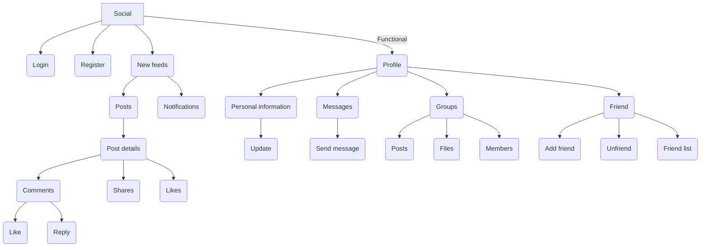

```mermaid
graph TD;
    A[Social] --> B(Login);
    A --> C(Register);
    A --> D(New feeds);
    A -->|Functional|E(Profile);
    D --> F(Posts);
    D --> D1(Notifications);
    F --> G(Post details);
    G --> H(Comments);
    G --> I(Shares);
    G --> J(Likes);
    H --> K(Like);
    H --> L(Reply);
    E --> M(Personal information);
    E --> N(Messages);
    E --> O(Groups);
    E --> P(Friend);
    M --> Q(Update);
    N --> R(Send message);
    O --> S(Posts);
    O --> T(Files);
    O --> U(Members);
    P --> V(Add friend);
    P --> W(Unfriend);
    P --> X(Friend list);
```
